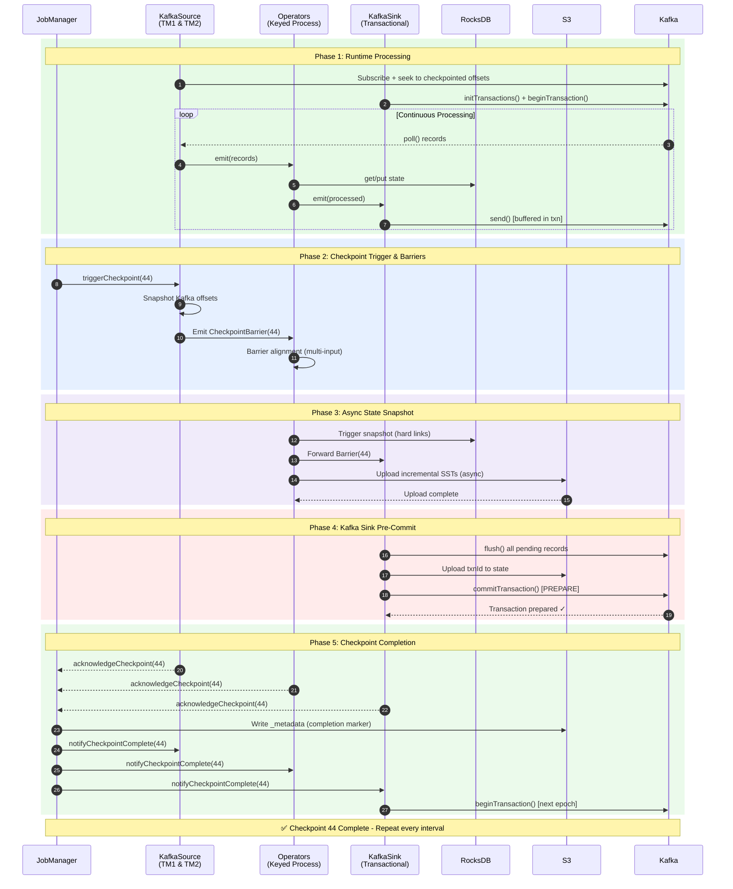
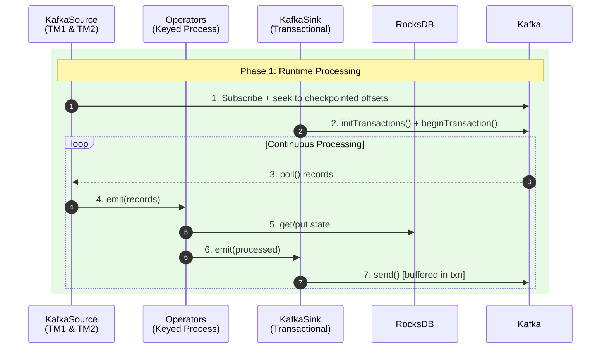
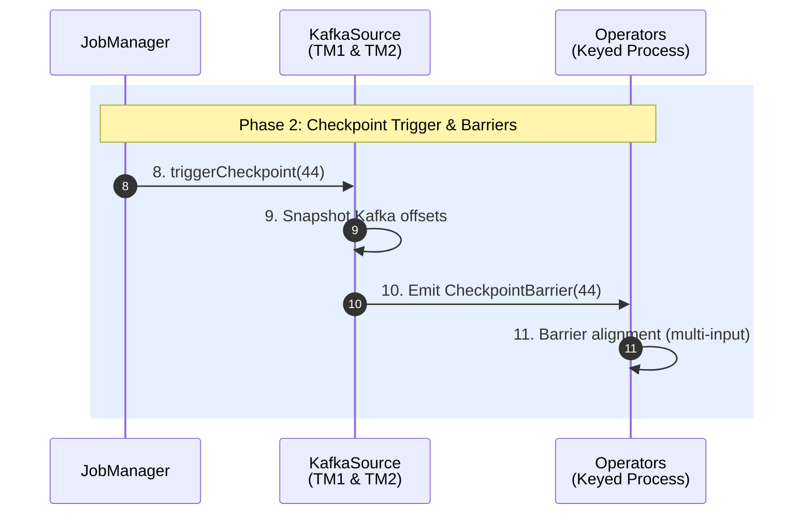
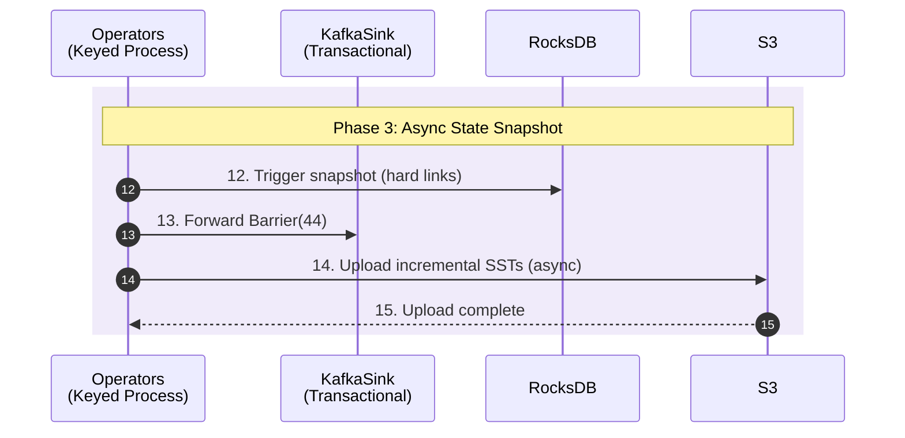
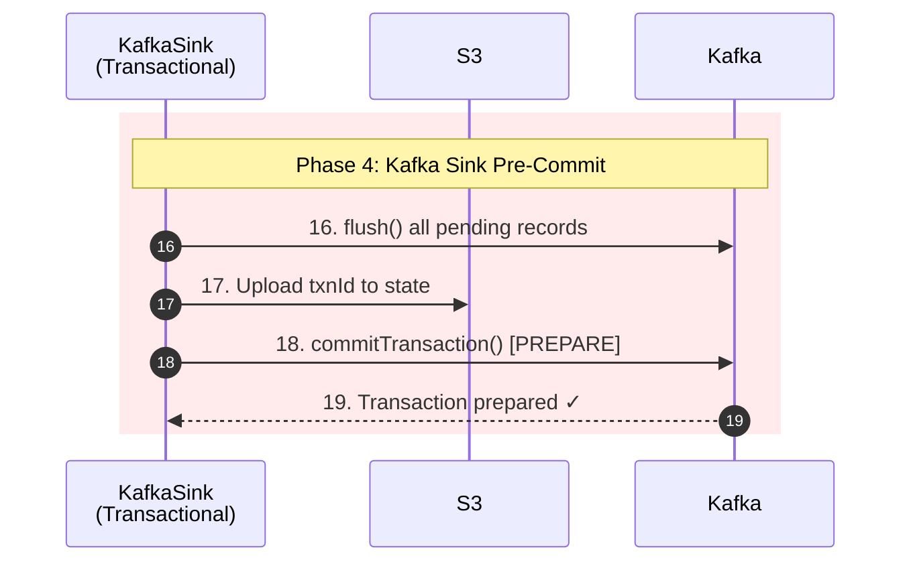
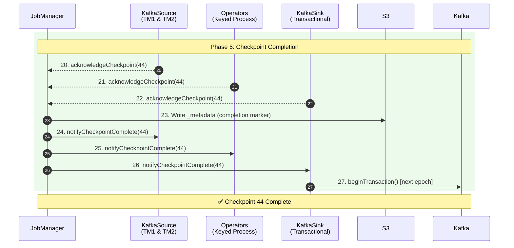

# Flink Introduction
Apache Flink is an open-source, distributed processing engine and framework designed for stateful computations over both unbounded (streaming) and bounded (batch) data set. Below image addresses main components of Flink:


- **JobManager**: The brain of the Flink cluster that runs as a single Pod. It coordinates job execution, manages TaskManager resources, and triggers checkpoints. Contains three key sub-components: Dispatcher (job submission), ResourceManager (slot allocation), and CheckpointCoordinator (checkpoint orchestration).

- **TaskManager**: Worker Pods that execute the actual data processing. Each TaskManager runs as a separate Pod and registers with the JobManager to offer its slots. A typical cluster has multiple TaskManager Pods distributed across Kubernetes nodes.

- **Slot**: A resource container within a TaskManager that provides memory and CPU share for execution. Each slot runs one Task (which contains one or more chained subtasks) and has its own RocksDB instance for state. The number of slots per TaskManager is configurable via taskmanager.numberOfTaskSlots.

- **Subtask**: A parallel instance of an operator — if map() has parallelism=4, there are 4 map subtasks (subtask-0 to subtask-3). Subtasks are logical units executed by Java threads; with operator chaining, multiple subtasks (e.g., Source-0 → Map-0 → Sink-0) run in the same thread. Each subtask owns a specific KeyGroup range and accesses only its portion of the keyed state.

- **Operator**: A processing unit that transforms data (e.g., map, filter, window, aggregate). Stateful operators store their state in RocksDB, while stateless operators process records without persistence. Multiple operators can be chained together in a single slot to avoid serialization overhead.

- **RocksDB**: An embedded key-value store that holds operator state on local disk. It stores data in immutable SST (Sorted String Table) files and supports state larger than memory. Each slot has its own RocksDB instance, but they share a memory cache within the TaskManager.

- **Ephemeral Storage**: Kubernetes-managed temporary storage attached to each TaskManager Pod. RocksDB writes SST files here during normal operation. This storage is deleted when the Pod terminates—S3 is the durable backup.

- **S3 (Checkpoint Storage)**: Durable object storage that holds checkpoint data for recovery. TaskManagers upload RocksDB SST files here, and JobManager marks checkpoint completion. On failure recovery, state is downloaded from S3 to restore the job.

- **ConfigMap (HA)**: Kubernetes ConfigMap used for JobManager high availability. It stores the leader election lock and current leader address. If the JobManager Pod crashes, a standby can take over by acquiring the lock.


# Flink Operation

## Overview

Flink's checkpoint mechanism ensures exactly-once semantics through a coordinated multi-phase process. The following diagram shows how all five phases work together:



---

## Phase 1: Runtime Processing



### Step 1: Source subscribes + seeks to checkpointed offsets

KafkaSource connects to Kafka brokers and subscribes to the configured input topic. Upon initialization, it reads the last checkpointed offsets from its restored operator state (e.g., `{partition-0: offset 1050, partition-1: offset 2600}`). The consumer then calls `seek()` to position itself exactly at these offsets.

This guarantees that on recovery, Flink re-reads records starting from the exact position when the last successful checkpoint was taken. Combined with transactional sink, this achieves exactly-once processing — no records are lost or duplicated.

**Note:** Flink stores offsets in its own state, NOT in Kafka's `__consumer_offsets` topic. Kafka's consumer group offsets are optionally committed for monitoring purposes only.


### Step 2: Sink start Kafka transaction

The KafkaSink initializes its transactional producer by calling `initTransactions()` with a deterministic `transactional.id` (typically derived from job ID + subtask index, e.g., `sink-job123-subtask0`).

Kafka broker registers this producer and assigns it a unique producer ID and epoch.

After initialization, the sink immediately calls `beginTransaction()` to start a new transaction.

From this point, all records sent by this producer are part of this transaction and remain **invisible** to consumers until committed.

The `transactional.id` enables Kafka to perform "zombie fencing" — if a previous instance of this producer had a pending transaction (from a crashed task), Kafka automatically aborts it when the new producer initializes with the same ID. This prevents duplicate writes from zombie producers.

**Note:** `transaction.timeout.ms` on Kafka broker must be greater than Flink's checkpoint interval, otherwise Kafka may abort the transaction before Flink can commit it.


### Step 3: Kafka returns polled records

The KafkaSource's internal consumer calls `poll(timeout)` to fetch a batch of records from its assigned partitions. Kafka returns records starting from the current consumer position. The poll returns a `ConsumerRecords` batch containing potentially hundreds or thousands of records.

Flink's KafkaSource uses a `SplitReader` that continuously polls in a loop.

Records are placed into a handover queue for the main task thread to process. This decouples network I/O from record processing.

### Step 4: Source emits records to operators

The source deserializes raw Kafka bytes into Flink records (using the configured deserializer) and emits them downstream. Before reaching the operator, each record goes through key-based routing to ensure it arrives at the correct subtask that owns its keyed state.
```
Record {key: "user-123", value: "..."}
    │
    ▼
Step A: Hash the key
    hash = MurmurHash("user-123") → 987654321
    │
    ▼
Step B: Map to KeyGroup
    keyGroup = hash % maxParallelism
    keyGroup = 987654321 % 128 → 49
    │
    ▼
Step C: Map KeyGroup to Subtask
    subtask = keyGroup * parallelism / maxParallelism
    subtask = 49 * 4 / 128 → 1
    │
    ▼
Step D: Route to target
    Subtask 1 → TM1, Slot 1 (owns KG 32-63)
```

This routing happens at the sender side (source operator). The KeyGroupStreamPartitioner calculates the target subtask, then the record is placed into the corresponding output channel.

All records with the same key ALWAYS route to the same subtask. This guarantees that state.get(key) and state.put(key, value) always access the same RocksDB instance — no distributed locking or cross-TM coordination needed.

Records are serialized into NetworkBuffer segments (32KB default). Each downstream subtask has a dedicated output channel. Buffers are sent via Netty TCP connections between TaskManagers. If source and operator are in the same slot (operator chaining), records pass through an in-memory handover without network serialization.

If downstream operators are slow, network buffers fill up, blocking the sender. This back-pressure propagates upstream, eventually causing the source to slow down its Kafka poll rate.

### Step 5: Operators read/write state in RocksDB

Keyed operators (e.g., `KeyedProcessFunction`, windows, aggregations) access their state through Flink's State API (`ValueState`, `MapState`, `ListState`). With RocksDB backend, these operations translate to RocksDB `get()` and `put()` calls on the local disk.

**Each operator subtask has its own RocksDB instance** storing state for its assigned KeyGroups. For example, subtask-0 with KeyGroups [0-31] has a RocksDB instance containing only keys that hash to those KeyGroups.

Performance characteristics:

- Reads: RocksDB first checks the in-memory block cache, then memtable, then SST files on disk
- Writes: Go to the memtable (in-memory), periodically flushed to SST files
- State size can exceed memory — RocksDB spills to disk automatically

Memory management: With `state.backend.rocksdb.memory.managed: true`, all RocksDB instances within a TaskManager share a memory budget carved from Flink's managed memory, preventing unbounded native memory growth.

### Step 6: Operators emit processed records to sink

After processing (transforming, aggregating, enriching), operators emit result records downstream to the sink. The records flow through the same network buffer mechanism. If the operator is the last one before the sink and they're in the same slot, records may pass through a simple in-memory handover (operator chaining) without network serialization.

### Step 7: Sink sends records to Kafka (buffered in txn)

The KafkaSink calls `producer.send(record)` for each incoming record. The Kafka producer batches these records in memory (controlled by `batch.size` and `linger.ms`) and sends them to Kafka brokers. Because a transaction is active, these records are written to Kafka partitions with a transactional marker.

**Critical behavior:** Records are physically stored in Kafka brokers, but consumers with `isolation.level=read_committed` cannot see them yet. They're in a "pending" state. Only after `commitTransaction()` will they become visible.

This loop (steps 3-7) runs continuously, processing thousands of records per second, until the CheckpointCoordinator triggers a checkpoint.

---

## Phase 2: Checkpoint Trigger & Barriers



### Step 8: JobManager triggers `checkpoint(44)`

The CheckpointCoordinator (running in JobManager) maintains a timer that fires according to `execution.checkpointing.interval`. When triggered, it:

1. Creates a `PendingCheckpoint` object with a unique checkpoint ID (e.g., 44)
2. Records the trigger timestamp
3. Starts a timeout timer (`execution.checkpointing.timeout`, default 10 minutes)
4. Sends `triggerCheckpoint(44, timestamp)` RPC to all source tasks

**Coordination:** The CheckpointCoordinator tracks acknowledgments from all tasks. The checkpoint only completes when ALL tasks have acknowledged. If any task fails or times out, the entire checkpoint is aborted.

### Step 9: Source snapshots Kafka offsets

Upon receiving the trigger RPC, the KafkaSource captures the current consumer position for each assigned partition. These offsets represent "how far we've read" at this exact moment.

For example: `{partition-0: 1050, partition-1: 2600}` means the source has consumed up to (but not including) offset 1050 on partition-0.

**Why snapshot here:** The offsets must be captured BEFORE injecting the barrier. This ensures the offsets match the position in the stream where the barrier is injected. On recovery, seeking to these offsets and replaying will produce the exact same stream of records.

### Step 10: Source emits `CheckpointBarrier(44)`

The source injects a special `CheckpointBarrier` event into its output stream. This barrier is not a regular record — it's a control message that flows through the entire dataflow graph along with regular records.

The stream looks like: `[record][record][record][BARRIER-44][record][record]...`

**Barrier semantics:** The barrier logically divides the stream into "before checkpoint 44" and "after checkpoint 44". All records before the barrier belong to checkpoint 44's state snapshot. Records after the barrier belong to the next checkpoint.

**No pause:** The source continues emitting records immediately after injecting the barrier. Processing is NOT paused.

### Step 11: Operators perform barrier alignment

When an operator receives a `CheckpointBarrier(44)` on one of its input channels, it must wait for the barrier to arrive on ALL input channels before snapshotting its state. This is called "barrier alignment."

**Multi-input example:** An operator joining two streams (input A and input B):
1. Barrier-44 arrives on input A
2. Operator blocks input A — buffers incoming records from A
3. Continues processing records from input B (pre-barrier records)
4. Barrier-44 arrives on input B
5. Both barriers received — operator snapshots state
6. Unblocks input A, processes buffered records

**Why alignment:** Ensures the snapshot reflects a consistent point-in-time across all inputs. Without alignment, the snapshot might include some records from "after" the barrier on one input but not another, leading to inconsistency.

**Unaligned checkpoints (alternative):** Flink 1.11+ supports unaligned checkpoints that skip alignment by storing in-flight records as part of the checkpoint. This reduces checkpoint latency under back-pressure but increases checkpoint size.

---

## Phase 3: Async State Snapshot



### Step 12: Operator triggers RocksDB snapshot

Once all barriers are aligned, the operator triggers a RocksDB snapshot. This is extremely fast because RocksDB uses hard links (on Linux) to create a point-in-time view of the SST files without copying data.

**Mechanics:**
1. Flink calls RocksDB's `checkpoint()` API
2. RocksDB creates hard links to all current immutable SST files
3. The memtable is flushed to a new SST file (ensuring all writes are captured)
4. A snapshot directory is created with hard links to all required SST files

**Why fast:** Hard links are filesystem-level pointers to the same data blocks. No data is copied — only file metadata is created. A multi-GB state can be "snapshotted" in milliseconds.


### Step 13: Operator forwards barrier to sink

Immediately after triggering the snapshot (but before waiting for upload), the operator forwards the `CheckpointBarrier(44)` to downstream operators/sinks.

**Async key insight:** The barrier is forwarded BEFORE the S3 upload completes. This allows downstream operators to begin their own snapshots in parallel. Processing of new records also continues immediately — the operator does not block waiting for S3.

The actual S3 upload happens on a separate async I/O thread pool, completely decoupled from the main processing thread.

### Step 14: Operator uploads incremental SSTs to S3

A background thread compares the current snapshot with the previous checkpoint to determine which SST files are new:

**Incremental checkpoint logic:**
- Checkpoint 43 had: `{000001.sst, 000002.sst, 000003.sst}`
- Current snapshot has: `{000001.sst, 000002.sst, 000003.sst, 000004.sst, 000005.sst}`
- New files to upload: `{000004.sst, 000005.sst}`
- Reused (reference only): `{000001.sst, 000002.sst, 000003.sst}`

The new SST files are uploaded to S3 under `shared/` directory. The `MANIFEST` and `CURRENT` files (which track the SST file list) are uploaded to `private/` directory (always new per checkpoint).

**S3 structure:**
```
s3://bucket/checkpoints/job-id/chk-44/
├── _metadata                    (written by JM at completion)
└── subtask-0/
    ├── shared/
    │   ├── 000004.sst          (new - uploaded)
    │   └── 000005.sst          (new - uploaded)
    └── private/
        ├── MANIFEST-000025      (always new)
        └── CURRENT              (always new)
```

**Deduplication:** Files in `shared/` are deduplicated across checkpoints. Old SST files (000001-000003) are NOT uploaded again — the checkpoint metadata simply references their existing S3 paths from previous checkpoints.

### Step 15: S3 confirms upload complete

Once all SST files and metadata are uploaded, S3 returns success. The operator records the S3 paths as `StateHandles` in the acknowledgment.

**StateHandle contents:**
- S3 paths to all required SST files (both new and reused)
- KeyGroup range this state covers
- Backend identifier (for validation on restore)

The state is now durable. Even if this TaskManager crashes now, the state can be recovered from S3.

---

## Phase 4: Kafka Sink Pre-Commit



### Step 16: Sink calls `flush()`

When the `CheckpointBarrier(44)` reaches the sink, the first step is to flush all buffered records. The Kafka producer may have records waiting in its internal batches (for efficiency). Calling `flush()` blocks until all buffered records are sent to Kafka brokers and acknowledged.

**After flush:** All records that entered the sink before the barrier are now physically stored in Kafka partitions. No records remain in producer memory.


### Step 17: Sink uploads `txnId` to S3

The sink snapshots its transaction state:
- `transactional.id`: e.g., `sink-job123-subtask0`
- `producerId`: assigned by Kafka
- `epoch`: current transaction epoch (incremented each checkpoint)

This state is uploaded to S3 as part of the checkpoint. On recovery, Flink uses this information to either abort or recover the pending transaction.


### Step 18: Sink calls `commitTransaction()` [PREPARE]

The sink calls `producer.commitTransaction()`. Despite the name, this is the **PREPARE** phase of two-phase commit (Kafka's transaction protocol handles the commit in two phases internally).

**What happens in Kafka:**
1. Producer sends `EndTxnRequest` with `COMMIT` action to transaction coordinator
2. Coordinator writes `PREPARE_COMMIT` to transaction log
3. Coordinator writes transaction markers to all involved partitions
4. Coordinator writes `COMMITTED` to transaction log
5. Returns success to producer

**Visibility after this step:** Records are now durable AND committed in Kafka. However, Flink has not yet written `_metadata` to S3. If Flink crashes after step 18 but before step 23, the checkpoint is incomplete — but the Kafka transaction is already committed.

**How Flink handles this:** On recovery, Flink checks if `_metadata` exists. If not, it ignores the pending checkpoint. The next successful checkpoint will overwrite the state, and the "orphaned" committed records will simply be re-processed and re-written (idempotent with proper key-based deduplication).

### Step 19: Kafka confirms transaction prepared

Kafka broker returns success, confirming the transaction is committed. The sink can now safely acknowledge the checkpoint to JobManager.

---

## Phase 5: Checkpoint Completion



### Steps 20-22: All tasks send `acknowledgeCheckpoint(44)`

Each task (sources, operators, sinks) sends an `acknowledgeCheckpoint` RPC to the CheckpointCoordinator containing:
- Checkpoint ID (44)
- State handles (S3 paths for keyed state, operator state)
- Checkpoint metrics (duration, state size, etc.)

The CheckpointCoordinator collects acknowledgments. It maintains a count and only proceeds when ALL tasks have acknowledged.

**Failure handling:** If any task fails to acknowledge before timeout, the entire checkpoint is aborted. Tasks are notified to discard their uploaded state, and the pending Kafka transaction (if not yet committed) is aborted.

### Step 23: JobManager writes `_metadata` to S3

This is the **critical atomic step**. The JobManager collects all state handles from all tasks and writes a single `_metadata` file to S3:

```
s3://bucket/checkpoints/job-id/chk-44/_metadata
```

**Contents of `_metadata`:**
- Checkpoint ID and timestamp
- All operator state handles (sources' Kafka offsets, sinks' txnIds)
- All keyed state handles (S3 paths to RocksDB SST files)
- Coordinator state (for source split assignment, etc.)

**Atomicity guarantee:** The `_metadata` file is written atomically (S3 PUT is atomic for single objects). Either the entire file exists or it doesn't. This file is the single source of truth — a checkpoint is valid if and only if its `_metadata` file exists and is complete.

### Steps 24-26: JobManager broadcasts `notifyCheckpointComplete(44)`

The CheckpointCoordinator sends `notifyCheckpointComplete(44)` RPC to all tasks. This informs tasks that:
- The checkpoint is officially complete
- They can release resources held for potential abort
- Sinks can consider the transaction finalized

**What tasks do on notification:**
- Sources: optionally commit offsets to Kafka's `__consumer_offsets` (for monitoring tools)
- Operators: release snapshot references (allow RocksDB to compact old SST files)
- Sinks: confirm transaction is finalized, prepare for next cycle

### Step 27: Sink begins new transaction

The sink calls `beginTransaction()` to start a fresh transaction for the next checkpoint cycle. The producer epoch is incremented. From this point, all new records are part of the new transaction.

**Consumer visibility:** With `isolation.level=read_committed`, Kafka consumers can now see all records from the committed transaction. The transaction markers tell consumers where the transaction boundary is.
