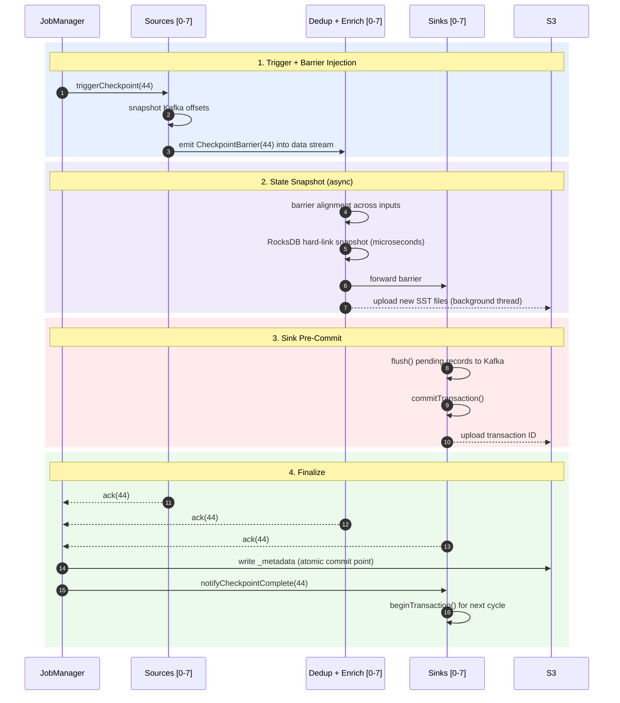

# The Problem

You have a Kafka topic receiving millions of user events per second. You need to:

1. **Deduplicate** events (same event ID must not be processed twice)
2. **Enrich** each event with business rules that can change at runtime (via a config stream)
3. **Write results** to an output Kafka topic with **exactly-once** guarantees

The pipeline looks like this:

```
Kafka "user-events" (8 partitions)
    → KafkaSource
    → Dedup operator (keyed state: has this event been seen before?)
    → Enrich operator (broadcast state: live config rules)
    → KafkaSink
Kafka "processed-events"
```

**Setup:** parallelism = 8, with 4 TaskManagers × 2 slots each.

This post follows a single message through this pipeline — from the moment it leaves Kafka to the moment its result is committed — and explains what happens at every physical layer along the way.

---

# The Cluster Before Any Message Arrives

When Flink starts this job, here is what the cluster physically looks like:

```
┌─────────────────────────────────────────────────┐
│ JobManager (single JVM process)                  │
│                                                  │
│ CheckpointCoordinator: triggers snapshots        │
│ SourceCoordinator: assigns Kafka partitions      │
│ ExecutionGraph: 8 instances of each operator     │
└─────────────────────────────────────────────────┘

┌──────────────────────────────────┐  ┌──────────────────────────────────┐
│ TaskManager-1 (JVM, 10 GB)       │  │ TaskManager-2 (JVM, 10 GB)       │
│                                  │  │                                  │
│ ┌──────────────────────────────┐ │  │ ┌──────────────────────────────┐ │
│ │ Slot 0                       │ │  │ │ Slot 2                       │ │
│ │ Source[0] → Dedup[0]         │ │  │ │ Source[2] → Dedup[2]         │ │
│ │ → Enrich[0] → Sink[0]       │ │  │ │ → Enrich[2] → Sink[2]       │ │
│ │ (reads Kafka partition 0)    │ │  │ │ (reads Kafka partition 2)    │ │
│ └──────────────────────────────┘ │  │ └──────────────────────────────┘ │
│ ┌──────────────────────────────┐ │  │ ┌──────────────────────────────┐ │
│ │ Slot 1                       │ │  │ │ Slot 3                       │ │
│ │ Source[1] → Dedup[1]         │ │  │ │ Source[3] → Dedup[3]         │ │
│ │ → Enrich[1] → Sink[1]       │ │  │ │ → Enrich[3] → Sink[3]       │ │
│ │ (reads Kafka partition 1)    │ │  │ │ (reads Kafka partition 3)    │ │
│ └──────────────────────────────┘ │  │ └──────────────────────────────┘ │
└──────────────────────────────────┘  └──────────────────────────────────┘

┌──────────────────────────────────┐  ┌──────────────────────────────────┐
│ TaskManager-3 (JVM, 10 GB)       │  │ TaskManager-4 (JVM, 10 GB)       │
│                                  │  │                                  │
│ ┌──────────────────────────────┐ │  │ ┌──────────────────────────────┐ │
│ │ Slot 4                       │ │  │ │ Slot 6                       │ │
│ │ Source[4] → Dedup[4]         │ │  │ │ Source[6] → Dedup[6]         │ │
│ │ → Enrich[4] → Sink[4]       │ │  │ │ → Enrich[6] → Sink[6]       │ │
│ │ (reads Kafka partition 4)    │ │  │ │ (reads Kafka partition 6)    │ │
│ └──────────────────────────────┘ │  │ └──────────────────────────────┘ │
│ ┌──────────────────────────────┐ │  │ ┌──────────────────────────────┐ │
│ │ Slot 5                       │ │  │ │ Slot 7                       │ │
│ │ Source[5] → Dedup[5]         │ │  │ │ Source[7] → Dedup[7]         │ │
│ │ → Enrich[5] → Sink[5]       │ │  │ │ → Enrich[7] → Sink[7]       │ │
│ │ (reads Kafka partition 5)    │ │  │ │ (reads Kafka partition 7)    │ │
│ └──────────────────────────────┘ │  │ └──────────────────────────────┘ │
└──────────────────────────────────┘  └──────────────────────────────────┘
```

A few things to notice:

- **8 Kafka partitions, parallelism 8, 8 slots** — each slot reads exactly one Kafka partition. This is the ideal 1:1 mapping. (If you had 16 partitions with parallelism 8, each slot would read 2 partitions. If you had 4 partitions with parallelism 8, 4 slots would sit idle — Flink never splits one Kafka partition across multiple readers.)

- **Slot sharing** means all four operators (Source, Dedup, Enrich, Sink) run inside the **same slot** for the same subtask index. Slot 0 runs Source[0], Dedup[0], Enrich[0], and Sink[0] — all in a single Java thread. This is called **operator chaining**: the output of one operator is passed to the next via a direct method call, with zero serialization and zero network cost.

- Each TaskManager is a single JVM process. Its 2 slots share the JVM heap and network buffers, but each slot gets its own **isolated managed memory** budget (for RocksDB). Slot 0 cannot borrow memory from Slot 1.

---

# Chapter 1: A Message Is Born

A user event arrives in Kafka partition 3 of the `user-events` topic:

```json
{
  "event_id": "evt-88821",
  "user_id": "user-42",
  "action": "purchase",
  "amount": 59.99,
  "timestamp": 1712100000000
}
```

Kafka stores it at **partition 3, offset 50701**.

---

# Chapter 2: Flink Picks It Up

Source[3] is running in **Slot 3 on TaskManager-2**. It has a background fetcher thread that continuously calls Kafka's `poll()`. Our message arrives in a batch of records. The fetcher places it into a hand-over queue, and the main task thread picks it up.

The source deserializes the raw Kafka bytes into a Flink `StreamRecord` — now it's a Java object living in the JVM heap of TaskManager-2.

**Important:** Flink does NOT use Kafka's consumer group offsets for recovery. It stores offsets in its own state. Kafka's `__consumer_offsets` may be committed optionally for monitoring, but Flink ignores it during failover.

---

# Chapter 3: The Dedup — Does This Message Need a Network Hop?

This is where the pipeline design matters. The Dedup operator is keyed by `event_id` — it needs to check "have I seen `evt-88821` before?" in its keyed state.

Since the pipeline uses `keyBy(event -> event.event_id)` before the Dedup operator, Flink must route each record to the subtask that **owns** that key's state. The routing works like this:

```
"evt-88821"
  → hashCode() → MurmurHash → modulo 128 → key group 71
  → key group 71 × 8 / 128 → subtask 4
```

Our message was read by Source[3] on TaskManager-2, but it needs to go to **Dedup[4] on TaskManager-3**. This means a **network shuffle** — the message must physically cross machines.

### What Happens on the Wire

1. **Serialization:** Source[3]'s thread serializes our message into bytes and writes them into a 32 KB network buffer (a `MemorySegment` from the pre-allocated network pool).

2. **Partitioning:** The `ResultPartition` for Source[3] has 8 sub-partitions (one per downstream Dedup subtask). Our message goes into sub-partition 4.

3. **TCP transport:** Since Dedup[4] lives on a different TaskManager, the buffer is sent via **Netty over TCP** from TaskManager-2 to TaskManager-3. The bytes travel through the OS TCP stack, across the physical network, and arrive at TaskManager-3's Netty server.

4. **Deserialization:** Dedup[4]'s input gate receives the buffer, deserializes it back into a `StreamRecord`, and hands it to the Dedup operator.

If Dedup[4] happened to be on the **same** TaskManager (e.g., if the routing landed on Dedup[3] in Slot 3), the transfer would be a memory-to-memory handoff within the same JVM — no TCP, no system calls. But the record would still be serialized/deserialized because the source and dedup run in different threads (the `keyBy` breaks operator chaining).

### Backpressure

What if Dedup[4] is slow? The receiving slot's input buffers fill up. It stops granting "credits" to the sender. The sender blocks because it has no credits to send. This blocking propagates backward: Source[3] eventually cannot emit records, which slows down its Kafka `poll()` rate. No data is ever dropped — the entire pipeline slows down together.

---

# Chapter 4: The Dedup Checks State — RAM or Disk?

Our message has arrived at **Dedup[4] in Slot 4, TaskManager-3**. The operator needs to check: has `evt-88821` been seen before?

Dedup[4] has its own RocksDB instance, living partly in RAM and partly on disk:

```
Slot 4's managed memory budget: ~2.5 GB (half of TM-3's 5 GB managed memory)
│
└── RocksDB for Dedup[4]:
    ├── Block cache (~180 MB): hot SST data blocks cached in RAM
    ├── Write buffer (~20 MB): recent writes sitting in a memtable
    └── SST files on disk: /tmp/flink/.../dedup_4/db/
        ├── 000001.sst (64 MB)
        ├── 000002.sst (64 MB)
        └── ...
```

The state lookup for `"evt-88821"` follows this path:

1. **Check the memtable (write buffer):** Was this key written very recently? If yes → answer from RAM in nanoseconds. If no →
2. **Check the block cache:** Is the SST data block containing this key already cached? If yes → answer from RAM in microseconds. If no →
3. **Check bloom filters (always in RAM):** Which SST files *might* contain this key? Bloom filters eliminate most SSTs instantly. For the remaining candidates →
4. **Read from disk:** Load the relevant data block from an SST file into the block cache, then return the value. Cost: milliseconds.

For deduplication with a short time window (most duplicates arrive within seconds), the block cache hit rate is typically 95%+. Our message's key is likely in the cache. The lookup takes microseconds.

**Result:** `evt-88821` has not been seen before. The Dedup operator writes `evt-88821 → true` to its RocksDB (which goes to the memtable — RAM speed), and passes the message downstream.

If it *had* been seen, the message would be silently dropped here. No further processing.

---

# Chapter 5: The Enrich — Broadcast State

The message moves from Dedup[4] to Enrich[4]. Since they're in the **same slot** and there's no `keyBy` between them, they are **chained** — the Dedup operator's `collect(record)` directly calls Enrich[4]'s `processElement(record)` as a Java method call. No serialization, no network buffer, no copy. The same Java object reference is passed. Cost: nanoseconds.

The Enrich operator needs to look up the current business rules. These rules come from a separate Kafka topic (`config-updates`) and are delivered to **all** parallel instances via **broadcast state**.

### How Broadcast State Works

Unlike keyed state (which is partitioned — each subtask holds different keys), broadcast state is **replicated** — every subtask holds the same complete copy. When a config update arrives on the config stream, Flink's `BroadcastPartitioner` sends it to all 8 subtasks. Each one updates its local copy independently.

Broadcast state lives as a plain **Java HashMap in JVM heap** — not in RocksDB. It's simple: Enrich[4] calls `broadcastState.get("pricing-rules")` which reads from an in-memory HashMap. No disk, no serialization.

Because every subtask holds an identical copy of the rules, all 8 Enrich instances apply the same logic — even though they process different keys. This is how you push live config changes to a running pipeline without restarting it.

### The Read/Write Asymmetry

When processing our user event (a regular element), the operator can only **read** the broadcast state. When processing a config update (a broadcast element), the operator can **write** to it. This asymmetry exists because regular elements are partitioned — different subtasks see different records. If they could all write to broadcast state differently, the copies would diverge. Only broadcast elements (which everyone sees) can modify it.

Our message is enriched with the current pricing rules and passed to the Sink.

---

# Chapter 6: The Sink — Writing to Kafka (But Not Committing Yet)

Enrich[4] and Sink[4] are also chained — same slot, same thread, direct method call. The enriched message arrives at Sink[4] with zero overhead.

Sink[4] has an open Kafka **transaction**. It calls the Kafka producer's `send()` to write our enriched message to the `processed-events` topic. The Kafka producer batches this with other records and sends them to the Kafka broker.

**Here's the critical thing:** the record is now physically stored in Kafka, but it is **invisible** to downstream consumers. Consumers with `isolation.level=read_committed` cannot see it. The Kafka transaction is still open. Our message is in limbo — written but not committed.

It will stay this way until the next checkpoint completes.

---

# Chapter 7: The Checkpoint — Making It All Durable

Every 30 seconds (configurable), the CheckpointCoordinator on the JobManager triggers a distributed snapshot. This is how Flink makes the pipeline's progress durable and enables exactly-once guarantees.

Here's what happens, and what our message's state looks like at each phase:


```mermaid
sequenceDiagram
    autonumber
    participant JM as JobManager
    participant Src as Sources [0-7]
    participant Op as Dedup + Enrich [0-7]
    participant Sink as Sinks [0-7]
    participant S3 as S3

    rect rgb(230, 240, 255)
        Note over JM,S3: 1. Trigger + Barrier Injection
        JM->>Src: triggerCheckpoint(44)
        Src->>Src: snapshot Kafka offsets
        Src->>Op: emit CheckpointBarrier(44) into data stream
    end

    rect rgb(240, 235, 250)
        Note over JM,S3: 2. State Snapshot (async)
        Op->>Op: barrier alignment across inputs
        Op->>Op: RocksDB hard-link snapshot (microseconds)
        Op->>Sink: forward barrier
        Op-->>S3: upload new SST files (background thread)
    end

    rect rgb(255, 235, 235)
        Note over JM,S3: 3. Sink Pre-Commit
        Sink->>Sink: flush() pending records to Kafka
        Sink->>Sink: commitTransaction()
        Sink-->>S3: upload transaction ID
    end

    rect rgb(235, 250, 235)
        Note over JM,S3: 4. Finalize
        Src-->>JM: ack(44)
        Op-->>JM: ack(44)
        Sink-->>JM: ack(44)
        JM->>S3: write _metadata (atomic commit point)
        JM->>Sink: notifyCheckpointComplete(44)
        Sink->>Sink: beginTransaction() for next cycle
    end
```

### Phase 1: Barrier Injection

The JobManager tells all 8 source subtasks: "start checkpoint 44." Each source snapshots its current Kafka offsets (e.g., Source[3] records `partition-3: offset 50702` — just past our message), then injects a `CheckpointBarrier` into the data stream. The barrier flows downstream like a regular record.

**Processing does not stop.** Sources keep emitting records after the barrier. The barrier is just a marker — "everything before me belongs to checkpoint 44."

### Phase 2: State Snapshot

When Dedup[4] receives barriers from all its input channels (barrier alignment ensures consistency across inputs), it snapshots its RocksDB. This happens in two phases:

- **Synchronous (microseconds):** Flush pending writes, then create hard links to all SST files. Hard links are just filesystem metadata — a 500 GB state is "frozen" in milliseconds with zero data copying.
- **Asynchronous (background thread):** Compare against the previous checkpoint. Upload only **new** SST files to S3. A 500 GB state that had 200 MB of new writes only uploads those 200 MB. This is incremental checkpointing — cost scales with write rate, not state size.

The barrier is forwarded to the Sink immediately after the sync phase. Processing of new records resumes in parallel with the S3 upload.

### Phase 3: Sink Pre-Commit

When the barrier reaches Sink[4]:
1. **Flush** all pending records to Kafka (our message was already sent, but any buffered-but-not-yet-sent records get flushed now)
2. **Commit** the Kafka transaction — our message and all other records in this transaction become visible to `read_committed` consumers
3. **Snapshot** the transaction ID to S3 for recovery purposes
4. **Begin** a new transaction for the next cycle

### Phase 4: Finalization

All 8 subtasks of all operators send `acknowledgeCheckpoint(44)` to the JobManager with their state handles (S3 paths). Once all 32 acknowledgments arrive (8 subtasks × 4 operators), the JobManager writes a single `_metadata` file to S3. This file is the **atomic commit point** — a checkpoint is valid if and only if its `_metadata` exists.

**Our message is now fully committed:** its Kafka offset is part of the checkpoint state, the Dedup "seen" flag is in the RocksDB snapshot on S3, and its output record is visible in the output Kafka topic.

If the entire cluster crashes after this checkpoint, Flink restores from S3 and resumes from exactly this point. Our message will not be reprocessed. No duplicates.

---

# What Makes This Scale?

Now that we've followed a single message through the pipeline, let's zoom out and see why this architecture handles millions of messages per second across terabytes of state.

## 1. Parallelism = Independent Lanes

Our 8 subtasks are 8 completely independent processing lanes. Dedup[0] and Dedup[4] never communicate with each other. They have separate RocksDB instances, separate managed memory, potentially on separate physical machines. Doubling parallelism to 16 doubles throughput — you just add more TaskManagers and Kafka partitions.

The key group system makes this possible. Each key deterministically maps to exactly one subtask. No distributed locks, no cross-node coordination, no shared state. Each lane is self-contained.

## 2. Slot Sharing = Resource Efficiency

With 4 operators and parallelism 8, a naive approach would need 32 slots. Slot sharing puts all operators for the same subtask index into one slot — only 8 slots needed. This also means chained operators (Dedup→Enrich→Sink) pass data via direct method calls instead of network serialization, which is orders of magnitude faster.

## 3. RocksDB = State Larger Than Memory

The Dedup operator might need to remember billions of event IDs. With `HashMapStateBackend`, this would require terabytes of JVM heap — impractical. RocksDB stores state on local SSD with an in-memory cache. Hot keys (recently seen events) are served from the block cache at RAM speed. Cold keys (old events) are read from disk. The block cache and bloom filters ensure most lookups avoid disk entirely.

Each slot's RocksDB gets its own isolated memory budget from managed memory (allocated outside the JVM heap via `Unsafe.allocateMemory`). This budget is split between a write buffer (~10%) for absorbing writes at RAM speed, and a block cache (~90%) for caching reads. Two operators in the same slot share this cache but slots never share with each other — preventing one slow subtask from starving its neighbor.

## 4. Incremental Checkpoints = Constant-Cost Snapshots

A 500 GB state doesn't mean 500 GB uploaded every 30 seconds. The synchronous phase creates hard links (microseconds), then a background thread uploads only new SST files. With a moderate write rate, each checkpoint might upload only a few hundred MB regardless of total state size. The processing thread is paused for less than 10 milliseconds.

## 5. Exactly-Once Without Sacrificing Throughput

The combination of:
- **Source:** Flink-managed Kafka offsets (rewindable on failure)
- **State:** Checkpoint barriers create consistent distributed snapshots without stopping processing
- **Sink:** Two-phase commit with Kafka transactions (records are invisible until committed)

...means every message is processed exactly once, even across failures. And because barriers flow through the data stream rather than requiring a global pause, throughput is barely affected during checkpointing.

## 6. Broadcast State = Live Config Without Restart

The Enrich operator reads business rules from a replicated in-memory HashMap — nanosecond lookups. Config changes from the config Kafka topic are automatically pushed to all 8 parallel instances. No job restart, no redeployment, no coordination. The cost is `parallelism × config_size` of JVM heap, which is trivial for typical config data.

---

# Physical Boundaries Summary

Where things are shared and where they're isolated:

| What | Shared? | Where it lives |
|------|---------|---------------|
| Managed memory (RocksDB cache) between slots on same TM | **No** — hard partition per slot | Off-heap native memory |
| RocksDB block cache between operators in same slot | **Yes** — shared within the slot | Slot's managed memory |
| RocksDB data files between operators in same slot | **No** — separate directories | Local disk |
| Keyed state between parallel subtasks | **No** — different key groups, different machines | Each subtask's own RocksDB |
| Broadcast state between subtasks | Same content, but **physically separate** copies | JVM heap per subtask |
| Network buffers between slots on same TM | **Soft sharing** — global pool, dynamic redistribution | Off-heap pre-allocated |
| Data between chained operators | **Zero-copy** — same Java object reference | Same thread, same stack frame |
| Data between non-chained operators (same TM) | Serialized, memory-to-memory | Network buffer pool, no TCP |
| Data between non-chained operators (different TM) | Serialized, **Netty over TCP** | Through the physical network |

---

# What Happens When Things Go Wrong

If TaskManager-3 crashes (which hosts Slot 4 and Slot 5 — including our message's Dedup[4] and Enrich[4]):

1. The JobManager detects the failure via heartbeat timeout
2. It restores from the last completed checkpoint (say, checkpoint 44)
3. New TaskManager slots download RocksDB SST files from S3
4. KafkaSources rewind to the checkpointed offsets
5. KafkaSinks abort any uncommitted transactions (zombie fencing kills old producers)
6. Processing resumes from exactly where checkpoint 44 left off

Messages that were processed between checkpoint 44 and the crash are replayed from Kafka. But because the Sink's transaction for those messages was never committed (it was part of the in-progress checkpoint 45 that didn't complete), downstream consumers never saw them. When they're reprocessed, it's as if the crash never happened.

This is exactly-once: the combination of rewindable sources, consistent state snapshots, and transactional sinks means every message is reflected in the output exactly one time, regardless of failures.
