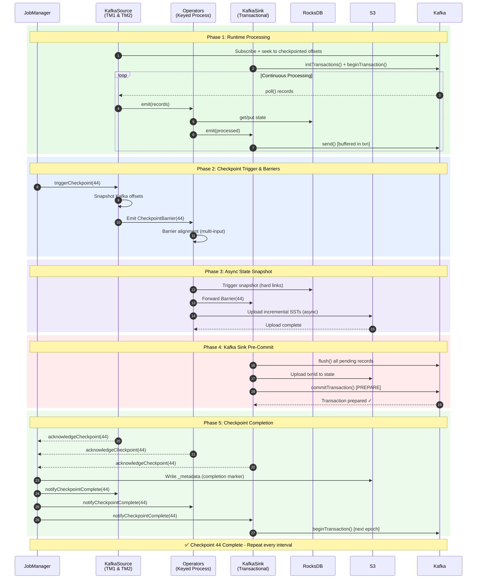

# Flink Introduction
Apache Flink is an open-source, distributed processing engine and framework designed for stateful computations over both unbounded (streaming) and bounded (batch) data set. Below image addresses main components of Flink:


- **JobManager**: The brain of the Flink cluster that runs as a single Pod. It coordinates job execution, manages TaskManager resources, and triggers checkpoints. Contains three key sub-components: Dispatcher (job submission), ResourceManager (slot allocation), and CheckpointCoordinator (checkpoint orchestration).

- **TaskManager**: Worker Pods that execute the actual data processing. Each TaskManager runs as a separate Pod and registers with the JobManager to offer its slots. A typical cluster has multiple TaskManager Pods distributed across Kubernetes nodes.

- **Slot**: A resource container within a TaskManager that provides memory and CPU share for execution. Each slot runs one Task (which contains one or more chained subtasks) and has its own RocksDB instance for state. The number of slots per TaskManager is configurable via taskmanager.numberOfTaskSlots.

- **Subtask**: A parallel instance of an operator — if map() has parallelism=4, there are 4 map subtasks (subtask-0 to subtask-3). Subtasks are logical units executed by Java threads; with operator chaining, multiple subtasks (e.g., Source-0 → Map-0 → Sink-0) run in the same thread. Each subtask owns a specific KeyGroup range and accesses only its portion of the keyed state.

- **Operator**: A processing unit that transforms data (e.g., map, filter, window, aggregate). Stateful operators store their state in RocksDB, while stateless operators process records without persistence. Multiple operators can be chained together in a single slot to avoid serialization overhead.

- **RocksDB**: An embedded key-value store that holds operator state on local disk. It stores data in immutable SST (Sorted String Table) files and supports state larger than memory. Each slot has its own RocksDB instance, but they share a memory cache within the TaskManager.

- **Ephemeral Storage**: Kubernetes-managed temporary storage attached to each TaskManager Pod. RocksDB writes SST files here during normal operation. This storage is deleted when the Pod terminates—S3 is the durable backup.

- **S3 (Checkpoint Storage)**: Durable object storage that holds checkpoint data for recovery. TaskManagers upload RocksDB SST files here, and JobManager marks checkpoint completion. On failure recovery, state is downloaded from S3 to restore the job.

- **ConfigMap (HA)**: Kubernetes ConfigMap used for JobManager high availability. It stores the leader election lock and current leader address. If the JobManager Pod crashes, a standby can take over by acquiring the lock.

---

# How Flink Physically Runs on the Machine

Before diving into the checkpoint lifecycle, it is essential to understand what is actually happening at the physical level — how memory is divided, where state bytes live on RAM versus disk, how parallel instances are isolated from each other, and how data physically moves between machines. Without this foundation, the checkpoint phases above remain abstract. This section makes them concrete.

## The TaskManager as a JVM Process

When a TaskManager starts, it is a **single JVM process** on a physical or virtual machine (or a Kubernetes Pod). Before any user task runs, this process carves its total memory into strictly separated regions — think of it like partitioning a hard drive before installing anything. This partitioning happens once at boot and never changes while the process is alive.

The total memory of that JVM process is divided into **six physical regions**:

```
TaskManager Process (e.g., 10 GB total)
│
├── JVM Heap (controlled by -Xmx JVM flag)
│   │
│   ├── Framework Heap (~400 MB)
│   │   Used by Flink's internal machinery: the Pekko actor system
│   │   for RPC communication between JobManager and TaskManagers,
│   │   classloaders, internal data structures, and logging buffers.
│   │   You never interact with this as a user.
│   │
│   └── Task Heap (e.g., 2 GB)
│       This is the "normal" Java heap where your user-defined functions live.
│       When your DeduplicateFunction creates a local HashMap, a String, or any
│       Java object during processElement(), it lives here. This memory is
│       garbage-collected normally by the JVM's GC (G1, ZGC, etc.).
│       Broadcast state (HeapBroadcastState) also lives here as a plain
│       Java HashMap — not in RocksDB.
│
├── JVM Direct Memory (controlled by -XX:MaxDirectMemorySize)
│   │
│   ├── Framework Off-Heap
│   └── Task Off-Heap
│       Allocated via ByteBuffer.allocateDirect(). Used for NIO operations
│       and Netty's internal buffers for network communication between
│       TaskManagers. Outside GC's reach but still tracked by the JVM.
│
├── Network Memory (e.g., 1 GB) — Off-heap, pre-allocated at startup
│   All allocated upfront as fixed-size MemorySegment objects (32 KB each)
│   into a global ArrayDeque pool called NetworkBufferPool.
│   This is the memory that physically holds serialized records traveling
│   between operators over the network (or between non-chained operators
│   on the same TaskManager).
│   SHARED across all TaskSlots — buffers are dynamically redistributed
│   based on demand via LocalBufferPool instances.
│
└── Managed Memory (e.g., 4 GB) — Off-heap, OUTSIDE the JVM's awareness
    Allocated via sun.misc.Unsafe.allocateMemory() — raw OS virtual memory.
    The JVM does not know this memory exists. It will never be garbage-collected.
    Flink tracks it manually using atomic compare-and-swap (CAS) counters
    in a structure called UnsafeMemoryBudget.
    This is where RocksDB block caches and write buffers live.
    HARD-PARTITIONED: divided equally among TaskSlots at startup.
    Each slot gets its own MemoryManager with its own budget.
    A slot CANNOT borrow from another slot — if its budget is exhausted,
    allocations block or fail.
```

There is a critical distinction between the last two regions. **Network memory** is a global shared pool — all slots draw from it, and buffers flow dynamically to wherever demand is highest. When one slot is doing heavy shuffling and another is idle, the busy slot can temporarily use more network buffers. This is "soft partitioning."

**Managed memory** is the opposite — "hard partitioning." At startup, Flink divides the total managed memory equally by the number of slots and gives each slot its own `MemoryManager` instance with its own `UnsafeMemoryBudget`. If a TaskManager has 4 GB of managed memory and 4 slots, each slot gets exactly 1 GB. Slot 0's `MemoryManager` cannot see or access Slot 1's memory. This isolation is enforced by atomic counters: when Slot 0's budget reaches zero, further allocations will fail, regardless of how much free budget Slot 1 has.

## What Physically Runs Inside a TaskSlot

A TaskSlot is not a process or a thread — it is a **logical resource container** within the TaskManager's JVM process. It owns:

1. A private portion of managed memory (its own `MemoryManager` instance)
2. A soft portion of network buffers (a `LocalBufferPool` drawn from the global `NetworkBufferPool`)
3. One or more **Task** objects, each with its own execution thread

Due to **slot sharing** (Flink's default behavior), a single slot typically runs one subtask from each operator in the pipeline. All operators in the same pipeline are placed into the same `SlotSharingGroup`, which means the scheduler co-locates them. For a pipeline of KafkaSource → Dedup → BusinessLogic → KafkaSink with parallelism=6, you need only **6 slots total** (not 24), because each slot runs one instance of every operator.

Here is what physically lives in a single TaskSlot for our example pipeline:

```
TaskSlot 0 (on TaskManager-1)
│
├── Managed Memory Budget: 1 GB (private, cannot be borrowed by other slots)
├── Network Buffers: ~256 MB (soft share from global pool)
│
├── Single Task Thread: runs all four chained operators in sequence
│   KafkaSource[0] → Dedup[0] → BizLogic[0] → KafkaSink[0]
│   (one Java thread executing all of them in a tight loop)
│
├── KafkaSource[0]'s state:
│   └── Operator state storing Kafka partition offsets
│       Lives in Task Heap (JVM heap) as a Java HashMap.
│       Small: just a few partition-offset pairs.
│
├── Dedup[0]'s keyed state:
│   └── RocksDB Instance #1 (for dedup "seen" flags)
│       RAM portion: block cache + write buffers
│         carved from this slot's 1 GB managed memory
│       Disk portion: SST files on local ephemeral storage
│         at /tmp/flink/job_{id}_op_dedup_uuid_{random}/db/
│
├── BizLogic[0]'s keyed state:
│   └── RocksDB Instance #2 (for per-user accumulators)
│       RAM portion: shares the SAME block cache as Dedup[0]'s RocksDB
│         (slot-level shared cache via RocksDBSharedResources)
│       Disk portion: SEPARATE SST files on local ephemeral storage
│         at /tmp/flink/job_{id}_op_bizlogic_uuid_{random}/db/
│
├── BizLogic[0]'s broadcast state:
│   └── Plain Java HashMap in Task Heap (JVM heap)
│       NOT in RocksDB. HeapBroadcastState wraps a Map<K,V>.
│       Contains the full copy of configuration rules.
│       Every parallel instance holds an identical copy.
│
└── KafkaSink[0]'s state:
    └── Operator state storing pending Kafka transaction IDs
        Lives in Task Heap as a Java LinkedHashMap.
```

The key takeaway: **each operator gets its own completely isolated state backend instance.** Dedup[0] and BizLogic[0] each have their own RocksDB database, their own column families, their own SST files on disk. Even though they run in the same slot, in the same thread, their state is invisible to each other. If Dedup[0] stores the key `"user-42"` with value `true`, BizLogic[0] has no way to read that value — it would need to go through its own state, which is a different RocksDB database entirely.

## How RocksDB Physically Sits on RAM and Disk

When Flink creates a RocksDB-backed keyed state for an operator subtask, it physically creates an **embedded RocksDB database** on the local filesystem. Each subtask's RocksDB is a self-contained database in its own directory:

```
/tmp/flink/job_{jobId}_op_{operatorId}_uuid_{randomUUID}/db/
├── 000001.sst       ← Immutable sorted data file (Level 0 or deeper)
├── 000002.sst       ← Typically 64 MB each (configurable)
├── 000003.sst
├── MANIFEST-000004  ← Tracks which SSTs belong to which compaction level
├── CURRENT          ← Points to the current MANIFEST file
├── LOG              ← RocksDB operational log (compaction events, etc.)
└── LOCK             ← Prevents concurrent access from another process
```

**Each Flink state descriptor becomes a RocksDB column family.** If your Dedup operator registers a `ValueState<Boolean>` named `"seen"` and a `MapState<String, Long>` named `"counters"`, RocksDB creates two column families: `"seen"` and `"counters"`. Think of column families as separate logical databases within the same RocksDB instance — they share the block cache and write buffer manager but maintain independent data files and independent compaction schedules.

### The RocksDB Memory Budget

RocksDB's in-memory structures are funded from the slot's managed memory. Here is how a slot's 1 GB of managed memory gets divided:

```
Slot's Managed Memory: 1 GB
│
│ Flink divides managed memory by consumer weights:
│   STATE_BACKEND (RocksDB):  weight 70
│   OPERATOR (sort/hash join): weight 70
│   PYTHON (PyFlink):          weight 30
│   Total weight = 170
│
├── RocksDB gets: 1 GB × (70 / 170) ≈ 412 MB
│   │
│   │ This 412 MB is shared across ALL RocksDB instances in this slot
│   │ (Dedup[0]'s RocksDB AND BizLogic[0]'s RocksDB share this budget)
│   │ via a single RocksDBSharedResources object.
│   │
│   ├── Write Buffer Manager: ~41 MB (10% of RocksDB budget)
│   │   This is the in-RAM memtable where new writes land before being flushed
│   │   to SST files on disk. When you call state.update(value), the serialized
│   │   key-value pair goes here first. When the memtable fills up, RocksDB
│   │   flushes it to disk as a new immutable SST file. This budget is shared
│   │   across both RocksDB instances — they compete for memtable space.
│   │
│   └── Block Cache: ~371 MB (90% of RocksDB budget)
│       LRU cache holding recently-accessed SST data blocks in RAM.
│       Also shared across both RocksDB instances.
│       │
│       ├── High Priority Pool: ~37 MB (10% of cache)
│       │   Reserved for index blocks and bloom filter blocks.
│       │   These are always kept in RAM to avoid disk seeks for key lookups.
│       │   Level-0 index and filter blocks are pinned — never evicted.
│       │   This is what makes "does this key exist?" checks fast.
│       │
│       └── Default Priority Pool: ~334 MB (90% of cache)
│           Holds actual data blocks containing your key-value pairs.
│           Evicted LRU (least recently used) when the cache is full.
│           A "hot" key that is accessed frequently stays in this cache.
│           A "cold" key that hasn't been seen in a while gets evicted
│           and must be re-read from disk on next access.
│
├── Operators (sort/hash): 1 GB × (70 / 170) ≈ 412 MB
│   Used by batch-style operators (sort, hash joins, etc.)
│   In a pure streaming pipeline, this is mostly unused.
│
└── Python: 1 GB × (30 / 170) ≈ 176 MB
    Used by PyFlink. Zero if you're using Java/Scala only.
```

**This is the critical sharing boundary.** The block cache and write buffer manager are shared across all RocksDB instances **within the same TaskSlot** (via the `RocksDBSharedResources` object). So Dedup[0]'s RocksDB and BizLogic[0]'s RocksDB compete for the same ~371 MB cache. But RocksDB instances in Slot 1 have a **completely separate** cache funded by Slot 1's managed memory — they never compete with Slot 0.

### What Happens During a State Read

When your operator calls `state.value()` for a key, the following happens on the physical machine:

1. Flink serializes the key into bytes (key group prefix + key bytes) using the configured `TypeSerializer`
2. RocksDB receives a `get()` call on the appropriate column family
3. RocksDB first checks the **memtable** (write buffer) — if this key was recently written, the latest value is here in RAM. Cost: nanoseconds.
4. If not in memtable, RocksDB checks the **block cache** — if the SST data block containing this key was recently read, it's cached in RAM. Cost: microseconds (hash lookup).
5. If both miss, RocksDB checks the **bloom filter** (in the high-priority cache pool) to determine which SST files *might* contain this key. Bloom filters can definitively say "this SST does NOT contain the key," avoiding unnecessary disk reads.
6. For SSTs that pass the bloom filter check, RocksDB reads the relevant data block from disk into the block cache, then returns the value. Cost: milliseconds (disk I/O).

For a hot-key dedup workload where most keys are seen within a short time window, the block cache hit rate can be 95% or higher, meaning the vast majority of state reads never touch disk. For a long-tail workload where keys are rarely repeated, the cache hit rate drops, and disk I/O becomes the bottleneck — this is when SSD versus HDD makes a dramatic difference.

### What Happens During a State Write

When your operator calls `state.update(value)`, the write path is:

1. Flink serializes the key and value into bytes
2. The write goes into a `RocksDBWriteBatchWrapper` — a buffer that batches multiple writes together
3. When the batch is flushed (either because it's full or because a checkpoint triggers), all writes go into the RocksDB memtable in one atomic operation
4. The memtable is an in-memory sorted structure (skip list). Writes are fast: microseconds.
5. When the memtable reaches its size limit, RocksDB flushes it to disk as a new immutable SST file (Level 0)
6. Background compaction threads periodically merge and sort SST files from Level 0 into deeper levels (Level 1, Level 2, etc.), removing deleted keys and merging duplicates

Writes are almost always RAM-speed because they only touch the memtable. Disk I/O happens in the background during flush and compaction, which is handled by RocksDB's dedicated background threads (default 2 per operator, configurable).

## How State Is Isolated Between Parallel Subtasks

State isolation between parallel instances of the same operator (e.g., Dedup[0] on TaskManager-1 vs. Dedup[3] on TaskManager-2) is **absolute**. They run in different TaskSlots, potentially on different physical machines, with completely separate RocksDB instances, separate managed memory budgets, and separate disk directories. They share nothing.

The mechanism that ensures each subtask only processes "its" data is the **key group** system. Flink pre-divides the entire key space into a fixed number of key groups (default 128, configurable via `maxParallelism`). The assignment is deterministic and uses a two-step hash:

1. Compute the key's `hashCode()`, then refine it with MurmurHash for better distribution
2. Take modulo `maxParallelism` to get the key group ID
3. Map the key group to a subtask: `subtask = keyGroup × parallelism / maxParallelism`

With parallelism=6 and maxParallelism=128, key groups are assigned as contiguous ranges:

```
Subtask 0: key groups [0 – 21]   → physically in Slot 0's RocksDB
Subtask 1: key groups [22 – 42]  → physically in Slot 1's RocksDB
Subtask 2: key groups [43 – 63]  → physically in Slot 2's RocksDB
Subtask 3: key groups [64 – 85]  → physically in Slot 3's RocksDB
Subtask 4: key groups [86 – 106] → physically in Slot 4's RocksDB
Subtask 5: key groups [107 – 127] → physically in Slot 5's RocksDB
```

When a record arrives at the network layer, the `KeyGroupStreamPartitioner` computes **the exact same hash** to determine which downstream subtask to route the record to. This is the fundamental invariant: the network routing and the state partitioning use the same formula. A record with key `"user-42"` that hashes to key group 35 will always be routed to Subtask 1, which is the only subtask that has the RocksDB data for key group 35. Records **cannot arrive at the wrong subtask.**

This means there is zero coordination between subtasks for state access — no distributed locks, no cross-network reads, no consensus protocols. Each subtask is a self-contained unit that reads and writes only its own local RocksDB. This is how Flink achieves linear horizontal scaling: doubling the parallelism doubles the number of independent state partitions, each handling half the key space.

## How Data Physically Moves Between Operators

There are two fundamentally different data paths depending on whether operators are **chained** or **not chained**:

### Chained Operators: Zero-Copy Method Calls

When operators are chained (the default when operators have the same parallelism and no shuffle boundary), there is **no serialization, no network buffer allocation, and no memory copy.** The upstream operator's `collect(record)` method literally calls the downstream operator's `processElement(record)` as a direct Java method invocation. The same `StreamRecord` Java object reference is passed down the call stack. This happens in the same thread, on the same stack frame. The cost is that of a normal Java method call — nanoseconds.

In our pipeline, if KafkaSource → Dedup → BizLogic → KafkaSink are all chained (same parallelism, no keyBy between them), then a single thread executes all four operators in sequence for each record. The record never leaves the thread, never gets serialized, and never touches the network buffer pool.

There is an optional "copying" mode where the record is deep-copied via the serializer before being passed downstream, to prevent mutation bugs where a downstream operator modifies an object that the upstream operator still references. But even in this mode, it's an in-memory copy within the same thread — no network involvement.

### Non-Chained Operators: Serialization and Network Transport

When operators are separated by a shuffle boundary (like `keyBy()`), data must be serialized and physically transported:

1. **Serialization**: The upstream operator's output record is serialized into bytes by the `RecordWriter`, with a 4-byte length prefix, into a `MemorySegment` (32 KB buffer) drawn from the network buffer pool.

2. **Partitioning**: The `ResultPartition` maintains one sub-partition per downstream subtask. The `KeyGroupStreamPartitioner` determines which sub-partition each record goes to based on the key hash.

3. **Physical Transport** depends on whether the consumer is on the same or a different TaskManager:

   - **Same TaskManager** (LocalInputChannel): The downstream task reads directly from the producer's sub-partition buffers. This is a memory-to-memory transfer within the same JVM process. No TCP socket, no system calls — just a pointer handoff between threads with appropriate synchronization. The record is still serialized/deserialized (because the operators run in different threads and may have different type information), but there is no network I/O.

   - **Different TaskManager** (RemoteInputChannel): The data crosses machine boundaries via **Netty over TCP**. The producer's Netty server writes buffer contents as framed messages over a TCP socket. The consumer's Netty client on the other machine receives them into its own network buffer pool. The bytes travel through the operating system's TCP stack, through the physical network, and into the receiving machine's kernel buffer before Netty reads them into Flink's pre-allocated `MemorySegment`.

4. **Deserialization**: The consumer deserializes bytes back into a `StreamRecord` Java object and passes it to the receiving operator.

### Backpressure at the Physical Level

Flink implements backpressure through a **credit-based flow control** mechanism at the network buffer level. Each `RemoteInputChannel` maintains a "credit" count — the number of available buffers it can receive into. The consumer periodically sends credit updates to the producer. The producer only sends data when it has credits available. When the consumer's operator is slow (e.g., waiting on a slow RocksDB disk read), it stops consuming buffers, credits run out, and the producer physically cannot send more data — it blocks. This blocking propagates upstream through the entire pipeline, eventually slowing down the Kafka consumer's `poll()` rate.

This is not a polling mechanism or a timer — it is a direct physical consequence of buffer exhaustion. When there are no free buffers to write into, the producing thread blocks on the buffer request. The backpressure latency is bounded by network round-trip time for credit updates.

## Kafka Source and Parallelism: How Partitions Map to Subtasks

Flink's Kafka source follows the **FLIP-27 Source API**, which separates the work into three components running on different parts of the cluster:

- **SplitEnumerator** runs on the JobManager (inside the `SourceCoordinator`). It connects to Kafka brokers, discovers all partitions for the subscribed topics, and wraps each partition as a `KafkaPartitionSplit`.
- **SourceReader** runs on each TaskManager, one per subtask. It reads from its assigned partitions using a KafkaConsumer.

The assignment follows a **lazy pull-based model**: when a SourceReader starts up, it sends a split request to the enumerator. The enumerator decides which partition(s) to assign to that subtask and sends them back. This is not a static assignment — the enumerator can dynamically reassign partitions.

**Concrete example:** If the `user-events` topic has 12 partitions and parallelism is 6:

```
KafkaSourceEnumerator (on JobManager):
  Discovered: partition-0 through partition-11

Assignment (round-robin or hash-based):
  SourceReader subtask 0 → [partition-0, partition-6]
  SourceReader subtask 1 → [partition-1, partition-7]
  SourceReader subtask 2 → [partition-2, partition-8]
  SourceReader subtask 3 → [partition-3, partition-9]
  SourceReader subtask 4 → [partition-4, partition-10]
  SourceReader subtask 5 → [partition-5, partition-11]
```

Each subtask's SourceReader uses a `SingleThreadFetcherManager` — a single background thread that creates one KafkaConsumer and multiplexes reads across all assigned partitions. Records are placed into a hand-over queue (`FutureCompletingBlockingQueue`) that the main task thread polls from.

**What if parallelism > number of partitions?** If you set parallelism=16 but only have 12 partitions, 4 subtasks will be completely idle. They request splits from the enumerator but receive a "no more splits" signal. Flink does not split a single Kafka partition across multiple readers — one partition is always consumed by exactly one reader.

**What if parallelism < number of partitions?** Each reader gets multiple partitions. With parallelism=3 and 12 partitions, each subtask reads 4 partitions. The single-thread fetcher handles this efficiently by polling all 4 partitions in the same KafkaConsumer.

**Optimal setup:** Set parallelism equal to (or a divisor of) the number of Kafka partitions for even load distribution.

## Broadcast State: How Configuration Syncs Across All Parallel Instances

Broadcast state solves a specific problem: how do you push configuration updates (feature flags, business rules, rate limits) to all parallel instances of an operator in real-time, without restarting the job?

### Physical Distribution Mechanism

When you call `configStream.broadcast(descriptor)`, Flink applies a `BroadcastPartitioner` to the config stream. Unlike all other partitioners (which route each record to exactly one downstream subtask), the broadcast partitioner tells the record writer to send every record to **all** downstream sub-partitions. Every parallel instance of the connected operator receives every config update.

This means if your business logic operator has parallelism=6, every config update is sent 6 times — once to each subtask. The network cost is proportional to `parallelism × config_event_size`.

### Where Broadcast State Lives in Memory

Broadcast state is **not** stored in RocksDB. It lives as a plain Java `HashMap` in the JVM heap (`HeapBroadcastState.backingMap`). This is fundamentally different from keyed state:

- **Keyed state**: partitioned across subtasks, each holding only its key group range, stored in RocksDB (managed memory + disk)
- **Broadcast state**: replicated identically across all subtasks, each holding the **complete** copy, stored in JVM heap

This means broadcast state consumes `parallelism × state_size` of total JVM heap across the cluster. If your config map is 100 MB and parallelism is 20, that's 2 GB of heap across all TaskManagers. Broadcast state should be kept small — it's designed for configuration data, not large datasets.

### Read/Write Asymmetry

The broadcast state API enforces a strict asymmetry to maintain consistency:

- When processing a **broadcast element** (a config update), your function gets **read-write** access to the broadcast state. This is where you call `state.put("rule-v3", newConfig)` to update the config.
- When processing a **regular element** (a user event), your function gets **read-only** access to the broadcast state. You can call `state.get("rule-v3")` to look up the current config, but you cannot modify it.

This design exists because regular elements are key-partitioned — different subtasks see different records. If they could modify broadcast state, each subtask would diverge, breaking the "identical copy" invariant. Only broadcast elements (which every subtask sees) can modify broadcast state, ensuring all copies stay in sync — as long as your update logic is deterministic.

### Checkpointing and Recovery

During checkpointing, broadcast state is serialized as operator state with `Mode.BROADCAST`. On recovery, Flink reads from just one partition (since they're all identical) and distributes it to all subtasks. During rescaling (e.g., parallelism 4 → 8), new subtasks receive a copy from any existing partition via round-robin — since all partitions are identical, every new instance gets the complete config.

## State Redistribution During Rescaling

When you rescale from parallelism=6 to parallelism=8 (e.g., via a savepoint and relaunch), the key group ranges change:

```
Before (parallelism=6):             After (parallelism=8):
Subtask 0: key groups [0 – 21]      Subtask 0: key groups [0 – 15]
Subtask 1: key groups [22 – 42]     Subtask 1: key groups [16 – 31]
Subtask 2: key groups [43 – 63]     Subtask 2: key groups [32 – 47]
Subtask 3: key groups [64 – 85]     Subtask 3: key groups [48 – 63]
Subtask 4: key groups [86 – 106]    Subtask 4: key groups [64 – 79]
Subtask 5: key groups [107 – 127]   Subtask 5: key groups [80 – 95]
                                     Subtask 6: key groups [96 – 111]
                                     Subtask 7: key groups [112 – 127]
```

New Subtask 1 needs key groups 16–31. Key groups 16–21 previously belonged to old Subtask 0, and key groups 22–31 belonged to old Subtask 1. Flink downloads the checkpoint state from **both** old subtasks' S3 snapshots.

For RocksDB, the restore process physically downloads the SST files, opens a temporary RocksDB instance, and runs a "clipping" operation that deletes all key-value pairs whose serialized key prefix (which encodes the key group ID) falls outside the new range. This is a compaction-like rewrite of the SST files. After clipping, the new subtask's RocksDB contains only the keys belonging to its assigned key group range.

This is why `maxParallelism` should be set higher than your expected maximum parallelism — it determines the granularity of state redistribution. With `maxParallelism=128`, you can rescale to any parallelism from 1 to 128 with clean key group splits. If you set `maxParallelism=6`, you can never scale beyond 6 subtasks because there aren't enough key groups to distribute.

## Full Physical Topology Example

Putting it all together, here is what the physical cluster looks like for our Kafka pipeline with parallelism=6, running on 2 TaskManagers with 3 slots each, sourcing from a Kafka topic with 12 partitions:

```
┌──────────────────────────────────────────────────────────────┐
│ JobManager Pod (JVM Process)                                 │
│                                                              │
│ ├── Dispatcher: receives job submissions                     │
│ ├── ResourceManager: tracks available TaskSlots              │
│ ├── JobMaster: owns the ExecutionGraph for this job          │
│ │   ├── CheckpointCoordinator: triggers checkpoint every 30s │
│ │   └── SourceCoordinator: assigns Kafka partitions to       │
│ │       source subtasks via split requests                   │
│ └── Heap: PendingCheckpoint objects, execution metadata      │
└──────────────────────────────────────────────────────────────┘

┌─────────────────────────────────────────────────────────────────┐
│ TaskManager-1 Pod (JVM Process, 10 GB total)                    │
│                                                                 │
│ JVM Heap: 2.4 GB (400 MB framework + 2 GB task)                │
│ Network Buffers: 1 GB (shared global pool, ~32K segments)       │
│ Managed Memory: 4 GB (hard-split: 1.33 GB per slot)            │
│                                                                 │
│ ┌─────────────────────────────────────────────────────────┐     │
│ │ Slot 0 — Managed Memory: 1.33 GB                        │     │
│ │                                                         │     │
│ │ Thread: Source[0](p0,p6) → Dedup[0] → Biz[0] → Sink[0] │     │
│ │                                                         │     │
│ │ RocksDB (Dedup[0]):                                     │     │
│ │   RAM: ~180 MB block cache (shared with Biz[0])         │     │
│ │   Disk: /tmp/...dedup.../db/ (SST files)                │     │
│ │                                                         │     │
│ │ RocksDB (Biz[0]):                                       │     │
│ │   RAM: shares same block cache as Dedup[0]              │     │
│ │   Disk: /tmp/...bizlogic.../db/ (separate SST files)    │     │
│ │                                                         │     │
│ │ Broadcast state (Biz[0]): ~5 MB in JVM heap             │     │
│ │ Kafka offsets (Source[0]): ~100 bytes in JVM heap        │     │
│ │ Pending txn (Sink[0]): ~200 bytes in JVM heap           │     │
│ └─────────────────────────────────────────────────────────┘     │
│                                                                 │
│ ┌─────────────────────────────────────────────────────────┐     │
│ │ Slot 1 — Managed Memory: 1.33 GB (completely separate)  │     │
│ │ Thread: Source[1](p1,p7) → Dedup[1] → Biz[1] → Sink[1] │     │
│ │ (Same structure, different key group range [22-42])      │     │
│ └─────────────────────────────────────────────────────────┘     │
│                                                                 │
│ ┌─────────────────────────────────────────────────────────┐     │
│ │ Slot 2 — Managed Memory: 1.33 GB (completely separate)  │     │
│ │ Thread: Source[2](p2,p8) → Dedup[2] → Biz[2] → Sink[2] │     │
│ │ (Same structure, different key group range [43-63])      │     │
│ └─────────────────────────────────────────────────────────┘     │
└─────────────────────────────────────────────────────────────────┘

┌─────────────────────────────────────────────────────────────────┐
│ TaskManager-2 Pod (JVM Process, 10 GB total)                    │
│ (Same memory layout as TM-1)                                    │
│                                                                 │
│ ┌─────────────────────────────────────────────────────────┐     │
│ │ Slot 3 — Source[3](p3,p9) → Dedup[3] → Biz[3] → Sink[3]│     │
│ │ (Key groups [64-85], completely isolated from TM-1)     │     │
│ └─────────────────────────────────────────────────────────┘     │
│                                                                 │
│ ┌─────────────────────────────────────────────────────────┐     │
│ │ Slot 4 — Source[4](p4,p10) → Dedup[4] → Biz[4] → Sink[4]│    │
│ └─────────────────────────────────────────────────────────┘     │
│                                                                 │
│ ┌─────────────────────────────────────────────────────────┐     │
│ │ Slot 5 — Source[5](p5,p11) → Dedup[5] → Biz[5] → Sink[5]│    │
│ └─────────────────────────────────────────────────────────┘     │
└─────────────────────────────────────────────────────────────────┘
```

## Physical Boundaries Summary

| Boundary | Shared? | Physical Location |
|----------|---------|-------------------|
| Managed memory between slots on same TM | **No** — hard partition, separate MemoryManager per slot | Off-heap (Unsafe.allocateMemory) |
| RocksDB block cache between operators in same slot | **Yes** — shared RocksDBSharedResources | Slot's managed memory |
| RocksDB block cache between different slots | **No** — separate cache per slot | Different managed memory partitions |
| RocksDB SST files between operators in same slot | **No** — separate directories per operator | Local disk |
| Keyed state between parallel subtasks | **No** — different key group ranges, different state backends | Different slots, potentially different machines |
| Broadcast state between subtasks | **Logically identical** copies, but **physically separate** HeapBroadcastState per subtask | JVM heap, per subtask |
| Network buffers between slots on same TM | **Soft sharing** — global pool with dynamic redistribution | Off-heap, pre-allocated |
| Data between chained operators | **Shared object reference** — zero-copy direct method call in same thread | JVM heap, same call stack |
| Data between non-chained operators (same TM) | Serialized, memory-to-memory via LocalInputChannel | Network buffer pool, no TCP |
| Data between non-chained operators (different TM) | Serialized, sent via Netty over TCP | Network buffer → TCP socket → remote network buffer |

---

# Checkpointing: The Mechanism That Ties It All Together

Everything described above — the memory partitioning, RocksDB on disk, key group isolation, Kafka partition assignment — would be useless without a way to create consistent, recoverable snapshots of the entire distributed pipeline. That mechanism is **checkpointing**, and it is what enables exactly-once semantics at scale.

## The Checkpoint Lifecycle at a Glance


```mermaid
sequenceDiagram
    autonumber

    participant JM as JobManager
    participant Src as KafkaSource<br/>(TM1 & TM2)
    participant Op as Operators<br/>(Keyed Process)
    participant Sink as KafkaSink<br/>(Transactional)
    participant RocksDB as RocksDB
    participant S3 as S3
    participant Kafka as Kafka

    rect rgb(230, 250, 230)
        Note over JM,Kafka: Phase 1: Runtime Processing
        Src->>Kafka: Subscribe + seek to checkpointed offsets
        Sink->>Kafka: initTransactions() + beginTransaction()

        loop Continuous Processing
            Kafka-->>Src: poll() records
            Src->>Op: emit(records)
            Op->>RocksDB: get/put state
            Op->>Sink: emit(processed)
            Sink->>Kafka: send() [buffered in txn]
        end
    end

    rect rgb(230, 240, 255)
        Note over JM,Kafka: Phase 2: Checkpoint Trigger & Barriers
        JM->>Src: triggerCheckpoint(44)
        Src->>Src: Snapshot Kafka offsets
        Src->>Op: Emit CheckpointBarrier(44)
        Op->>Op: Barrier alignment (multi-input)
    end

    rect rgb(240, 235, 250)
        Note over JM,Kafka: Phase 3: Async State Snapshot
        Op->>RocksDB: Trigger snapshot (hard links)
        Op->>Sink: Forward Barrier(44)
        Op->>S3: Upload incremental SSTs (async)
        S3-->>Op: Upload complete
    end

    rect rgb(255, 235, 235)
        Note over JM,Kafka: Phase 4: Kafka Sink Pre-Commit
        Sink->>Kafka: flush() all pending records
        Sink->>S3: Upload txnId to state
        Sink->>Kafka: commitTransaction() [PREPARE]
        Kafka-->>Sink: Transaction prepared ✓
    end

    rect rgb(235, 250, 235)
        Note over JM,Kafka: Phase 5: Checkpoint Completion
        Src-->>JM: acknowledgeCheckpoint(44)
        Op-->>JM: acknowledgeCheckpoint(44)
        Sink-->>JM: acknowledgeCheckpoint(44)

        JM->>S3: Write _metadata (completion marker)
        JM->>Src: notifyCheckpointComplete(44)
        JM->>Op: notifyCheckpointComplete(44)
        JM->>Sink: notifyCheckpointComplete(44)

        Sink->>Kafka: beginTransaction() [next epoch]
    end

    Note over JM,Kafka: ✅ Checkpoint 44 Complete - Repeat every interval
```

## Phase 1: Runtime Processing

During normal processing, the pipeline runs as a tight loop. The KafkaSource polls records from Kafka, deserializes them, and routes each record to the correct downstream subtask based on the key group hash (as described in the previous sections). Operators read and write keyed state in RocksDB. The KafkaSink writes output records into an open Kafka **transaction** — records are physically stored in Kafka brokers but remain invisible to downstream consumers with `isolation.level=read_committed` until committed.

Key details that matter for scale:

- **Flink manages its own offsets.** KafkaSource stores partition offsets in Flink's operator state, not in Kafka's `__consumer_offsets`. On recovery, Flink rewinds to the exact checkpointed position.
- **Sink transactions are pre-opened.** Each sink subtask maintains a running Kafka transaction (with a deterministic `transactional.id` like `sink-job123-subtask0`). Kafka's "zombie fencing" automatically aborts orphaned transactions from crashed producers that had the same transactional ID.
- **Backpressure is physical.** If downstream operators are slow, network buffers fill up, the sender blocks, and the pressure propagates all the way back to the source's `poll()` rate — no data is dropped.

## Phase 2: Checkpoint Trigger and Barrier Flow

Periodically (e.g., every 30 seconds), the `CheckpointCoordinator` on the JobManager sends a `triggerCheckpoint` RPC to all source subtasks. Each source captures its current Kafka offsets, then injects a `CheckpointBarrier` into its output stream — a special control event that flows through the DAG alongside regular records.

The barrier logically divides the stream: everything before it belongs to this checkpoint, everything after belongs to the next. **Processing does not pause** — the source continues emitting records immediately after injecting the barrier.

When an operator with multiple inputs receives a barrier on one channel but not yet on others, it performs **barrier alignment**: it blocks the already-barriered channel and continues processing from the others until all channels have delivered the barrier. This ensures the state snapshot reflects a consistent cut across all inputs. (Flink also supports **unaligned checkpoints** that skip alignment by including in-flight buffered records in the snapshot — this trades larger checkpoint size for lower latency under backpressure.)

## Phase 3: Async State Snapshot

Once barriers are aligned, the operator snapshots its state in **two phases**:

1. **Synchronous (microseconds):** Flush the RocksDB write batch, then call RocksDB's native `checkpoint()` API, which creates **hard links** to all current SST files. No data is copied — hard links are just filesystem metadata pointing to the same disk blocks. A multi-GB state is "frozen" in milliseconds. The barrier is immediately forwarded downstream so the next operator can begin its snapshot in parallel.

2. **Asynchronous (seconds, on a background thread):** Compare the hard-linked SST files against the previous checkpoint. Only **new** SST files (those produced since the last checkpoint) are uploaded to S3. Previously uploaded files are referenced by metadata only. This is why incremental checkpointing cost is proportional to the **write rate**, not the **total state size** — a 1 TB state with a modest write rate might only upload a few hundred MB per checkpoint.

The S3 structure looks like:
```
s3://bucket/checkpoints/job-id/chk-44/
├── _metadata                    (written by JM at completion)
└── subtask-0/
    ├── shared/
    │   ├── 000004.sst          (new - uploaded this checkpoint)
    │   └── 000005.sst          (new - uploaded this checkpoint)
    └── private/
        ├── MANIFEST-000025      (always new - tracks SST inventory)
        └── CURRENT
```

## Phase 4: Kafka Sink Two-Phase Commit

When the barrier reaches the sink, the sink performs the **pre-commit** of the Kafka transaction:

1. **Flush** all buffered records to Kafka brokers (ensures nothing remains in producer memory)
2. **Snapshot** the transaction ID and producer epoch to S3 (for recovery)
3. **Commit** the Kafka transaction — records become visible to `read_committed` consumers

If Flink crashes after the Kafka commit but before the checkpoint finalizes, the committed records are "orphaned." On recovery, Flink rewinds to the previous checkpoint and re-processes. The next successful checkpoint overwrites the state, and idempotent processing handles the duplicate writes.

## Phase 5: Checkpoint Completion

All tasks (sources, operators, sinks) send `acknowledgeCheckpoint` RPCs to the JobManager with their state handles (S3 paths to SST files, Kafka offsets, transaction IDs). Once **all** tasks acknowledge, the JobManager writes a single `_metadata` file to S3 — this is the atomic commit point. A checkpoint is valid if and only if its `_metadata` file exists.

The JobManager then broadcasts `notifyCheckpointComplete` to all tasks:
- Sources optionally commit offsets to Kafka's `__consumer_offsets` (for monitoring only)
- Operators release old snapshot references so RocksDB can compact
- Sinks begin a new transaction for the next cycle

If any task fails to acknowledge before timeout, the entire checkpoint is aborted — no partial state is persisted.

## Why This Scales

The checkpoint mechanism is designed so that its cost does **not** grow with total state size:

- **Incremental snapshots** mean only new SST files are uploaded, not the entire state
- **Async upload** means the main processing thread pauses for microseconds (hard-link creation only), not seconds
- **Parallel snapshots** across operators mean the barrier-to-completion time is bounded by the slowest single operator, not the sum of all operators
- **Independent per-subtask state** means there is zero coordination between parallel instances during snapshotting — each subtask snapshots its own RocksDB independently

A pipeline with 500 GB of total state across 100 subtasks, checkpointing every 30 seconds, might only upload 2 GB of new SST files per checkpoint cycle. The processing thread pauses for less than 10ms per checkpoint. This is how Flink maintains exactly-once guarantees at tremendous scale without sacrificing throughput.
